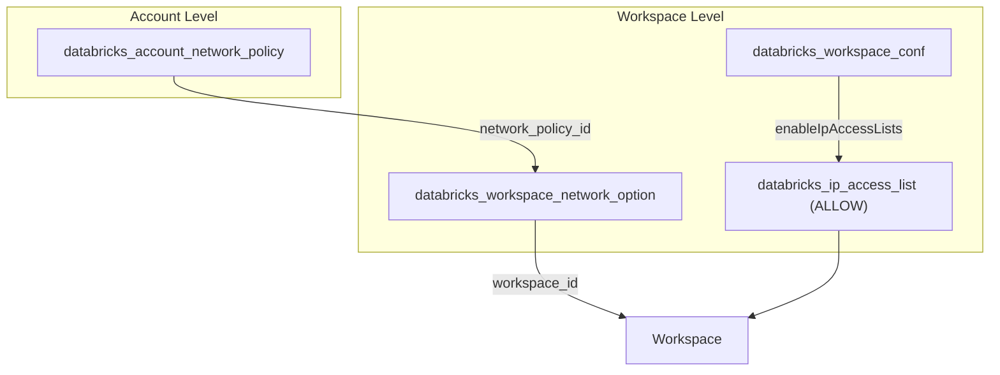

### Azure Databricks Terraform
azure-sandbox-field-eng 에 배포하는 테라폼 예시

# 1. 샘플 파일 복사

cp terraform.tfvars.example terraform.tfvars

# 2. terraform.tfvars 파일에서 값 수정

# 3. 실행

terraform init

terraform plan

terraform apply

# 4. Caveats
기존 state에 workspace provider로 생성된 SP가 남아있다면, terraform state rm databricks_service_principal.mi_sp로 state에서 제거한 뒤 다시 terraform apply를 실행해야 할 수 있습니다.

## Account Network Policy + Workspace IP Access List
